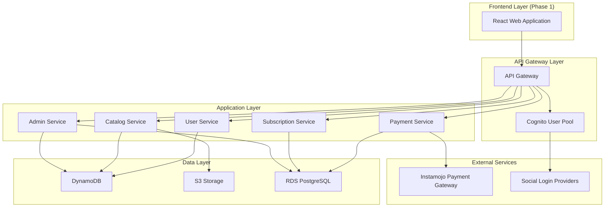

# Design Document

## Overview

The Marketplace Platform is a cloud-native, serverless application built on AWS using the AWS CDK for infrastructure as code. The platform follows a microservices architecture with modular CDK constructs, enabling **phased development and deployment with incremental feature rollouts**.

The system supports multi-tenant operations with role-based access control for customers, partners, and administrators. **Each phase will focus on specific persona workflows with pre-populated sample data** to enable immediate testing and demonstration of functionality.

The platform leverages AWS managed services for scalability, security, and cost-effectiveness, with Razorpay integration for payment processing supporting Indian card payments, UPI, and other payment methods. Razorpay offers the most competitive rates at 2% + GST with free integration and T+1 settlement.

### Phased Development Strategy

**Phase 1: Foundation & Customer Experience**
- Basic authentication and user registration
- Solution catalog browsing with pre-populated sample solutions
- Basic payment flow (buy now functionality)
- Sample customer accounts for testing

**Phase 2: Partner Experience**
- Partner registration and solution management
- Solution approval workflow
- Partner dashboard with sample data
- Commission calculation framework

**Phase 3: Administrative Controls**
- Admin dashboard with comprehensive management tools
- Advanced analytics and reporting
- Commission configuration and payout management
- Platform-wide settings and controls

**Phase 4: Advanced Features**
- Subscription management and recurring billing
- Advanced search and filtering
- Enhanced analytics and insights
- Mobile application development

## Architecture

### High-Level Architecture



### Technology Stack

**Backend Infrastructure:**
- **Infrastructure**: AWS CDK (TypeScript)
- **Compute**: AWS Lambda Functions
- **API**: Amazon API Gateway (REST API)
- **Authentication**: Amazon Cognito User Pools with Social Identity Providers
- **Database**: 
  - Amazon DynamoDB (user profiles, catalog, sessions)
  - Amazon RDS PostgreSQL (transactions, subscriptions, financial data)
- **Storage**: Amazon S3 (solution assets, documentation, images)
- **Payment Processing**: Razorpay Payment Gateway (recommended - lowest fees at 2% + GST, free integration)
- **Monitoring**: Amazon CloudWatch
- **Security**: AWS IAM, AWS Secrets Manager

**Frontend Stack (Phase 1 - Web Application Priority):**
- **Framework**: React 18 with TypeScript
- **Build Tool**: Vite for fast development and building
- **Styling**: Tailwind CSS for utility-first styling
- **State Management**: Zustand for lightweight state management
- **Routing**: React Router v6 for client-side routing
- **HTTP Client**: Axios for API communication
- **Form Handling**: React Hook Form with Zod validation
- **UI Components**: Headless UI + custom components
- **Authentication**: AWS SDK for JavaScript v3 with Cognito integration (lighter than Amplify)
- **Deployment**: AWS S3 + CloudFront (recommended over Amplify for better cost control and custom domain management)

**Frontend Deployment Strategy:**
- **S3 + CloudFront** (Recommended):
  - Better cost control for high-traffic marketplace
  - Custom domain and SSL certificate management
  - Global CDN for faster loading
  - More granular caching control
  - Integrates well with CDK infrastructure as code

- **AWS Amplify** (Alternative):
  - Simpler deployment and CI/CD
  - Built-in preview environments
  - Automatic SSL and domain management
  - Higher cost for high-traffic applications

**Future Phase - Mobile Application:**
- **Framework**: React Native (to leverage existing React knowledge)
- **State Management**: Same Zustand stores as web app
- **Navigation**: React Navigation
- **Deployment**: App Store and Google Play Store

## Components and Interfaces

### 1. Authentication Service

**Purpose**: Handles user authentication, registration, and session management

**Key Components**:
- Amazon Cognito User Pool with custom attributes
- Social identity providers (Google, GitHub)
- JWT token validation middleware
- Role-based access control (Customer, Partner, Admin)

**Interfaces**:
```typescript
interface AuthService {
  registerUser(userData: UserRegistration): Promise<AuthResult>
  authenticateUser(credentials: LoginCredentials): Promise<AuthResult>
  socialLogin(provider: SocialProvider, token: string): Promise<AuthResult>
  validateToken(token: string): Promise<UserContext>
  refreshToken(refreshToken: string): Promise<AuthResult>
}
```

### 2. User Management Service

**Purpose**: Manages user profiles, partner applications, and user lifecycle

**Key Components**:
- User profile management
- Partner application workflow
- User role and permission management
- Profile verification and KYC

**Interfaces**:
```typescript
interface UserService {
  createUserProfile(userId: string, profile: UserProfile): Promise<void>
  updateUserProfile(userId: string, updates: Partial<UserProfile>): Promise<void>
  submitPartnerApplication(userId: string, application: PartnerApplication): Promise<string>
  approvePartnerApplication(applicationId: string): Promise<void>
  getUsersByRole(role: UserRole): Promise<User[]>
}
```

### 3. Catalog Management Service

**Purpose**: Manages solution listings, categories, and marketplace content

**Key Components**:
- Solution CRUD operations
- Category and tag management
- Search and filtering capabilities
- Content moderation workflow

**Interfaces**:
```typescript
interface CatalogService {
  createSolution(partnerId: string, solution: SolutionData): Promise<string>
  updateSolution(solutionId: string, updates: Partial<SolutionData>): Promise<void>
  searchSolutions(criteria: SearchCriteria): Promise<Solution[]>
  approveSolution(solutionId: string): Promise<void>
  getSolutionsByPartner(partnerId: string): Promise<Solution[]>
}
```

### 4. Payment Processing Service

**Purpose**: Handles payment transactions, commission calculation, and settlement

**Key Components**:
- Razorpay payment integration
- Transaction recording and tracking
- Commission calculation engine
- Partner payout management

**Interfaces**:
```typescript
interface PaymentService {
  createPaymentRequest(transaction: TransactionRequest): Promise<PaymentRequest>
  processPaymentCallback(callbackData: RazorpayCallback): Promise<TransactionResult>
  calculateCommission(amount: number, solutionId: string): Promise<CommissionBreakdown>
  processPartnerPayout(partnerId: string, period: PayoutPeriod): Promise<PayoutResult>
}
```

### 5. Subscription Management Service

**Purpose**: Manages recurring subscriptions, billing cycles, and subscription lifecycle

**Key Components**:
- Subscription creation and management
- Recurring billing automation
- Subscription cancellation and refunds
- Usage tracking and metering

**Interfaces**:
```typescript
interface SubscriptionService {
  createSubscription(customerId: string, solutionId: string, plan: SubscriptionPlan): Promise<string>
  cancelSubscription(subscriptionId: string): Promise<void>
  processRecurringBilling(): Promise<BillingResult[]>
  getCustomerSubscriptions(customerId: string): Promise<Subscription[]>
  updateSubscriptionPlan(subscriptionId: string, newPlan: SubscriptionPlan): Promise<void>
}
```

### 6. Administrative Service

**Purpose**: Provides comprehensive platform management capabilities

**Key Components**:
- User and partner management
- Solution moderation
- Commission configuration
- Analytics and reporting

**Interfaces**:
```typescript
interface AdminService {
  getPlatformAnalytics(period: DateRange): Promise<PlatformAnalytics>
  manageCommissionRates(rates: CommissionRateConfig): Promise<void>
  moderateContent(contentId: string, action: ModerationAction): Promise<void>
  generateReports(reportType: ReportType, parameters: ReportParameters): Promise<Report>
}
```

## Data Models

### User Profile
```typescript
interface UserProfile {
  userId: string
  email: string
  role: 'customer' | 'partner' | 'admin'
  profile: {
    name: string
    company?: string
    contactInfo: ContactInfo
  }
  socialAccounts?: SocialAccount[]
  createdAt: Date
  lastLoginAt: Date
  status: 'active' | 'suspended' | 'pending'
}
```

### Solution
```typescript
interface Solution {
  solutionId: string
  partnerId: string
  name: string
  description: string
  category: string
  tags: string[]
  pricing: {
    model: 'upfront' | 'subscription'
    amount: number
    currency: 'INR'
    billingCycle?: 'monthly' | 'annual'
  }
  assets: {
    images: string[]
    documentation: string[]
    downloadUrl?: string
  }
  status: 'draft' | 'pending' | 'approved' | 'rejected'
  createdAt: Date
  updatedAt: Date
}
```

### Transaction
```typescript
interface Transaction {
  transactionId: string
  customerId: string
  solutionId: string
  partnerId: string
  amount: number
  commission: CommissionBreakdown
  paymentMethod: 'card' | 'upi'
  razorpayPaymentId: string
  status: 'pending' | 'completed' | 'failed' | 'refunded'
  createdAt: Date
  completedAt?: Date
}
```

### Subscription
```typescript
interface Subscription {
  subscriptionId: string
  customerId: string
  solutionId: string
  plan: SubscriptionPlan
  status: 'active' | 'cancelled' | 'expired' | 'suspended'
  currentPeriodStart: Date
  currentPeriodEnd: Date
  nextBillingDate: Date
  createdAt: Date
  cancelledAt?: Date
}
```

## Error Handling

### Error Categories
1. **Authentication Errors**: Invalid credentials, expired tokens, unauthorized access
2. **Validation Errors**: Invalid input data, missing required fields
3. **Business Logic Errors**: Insufficient funds, duplicate registrations, policy violations
4. **External Service Errors**: Payment gateway failures, social login issues
5. **System Errors**: Database connectivity, service unavailability

### Error Response Format
```typescript
interface ErrorResponse {
  error: {
    code: string
    message: string
    details?: any
    timestamp: Date
    requestId: string
  }
}
```

### Retry and Circuit Breaker Patterns
- Implement exponential backoff for external service calls
- Circuit breaker pattern for Razorpay payment gateway integration
- Dead letter queues for failed payment processing
- Graceful degradation for non-critical features

## Testing Strategy

### Unit Testing
- Jest for Lambda function testing
- Mock external dependencies (Instamojo, Cognito)
- Test coverage minimum 80% for business logic
- Property-based testing for financial calculations

### Integration Testing
- API Gateway endpoint testing
- Database integration tests with test containers
- Payment flow integration with Razorpay test environment
- Authentication flow testing with Cognito

### End-to-End Testing
- Cypress for web application testing
- User journey testing (registration → purchase → subscription)
- Cross-browser compatibility testing
- Mobile responsiveness testing

### Performance Testing
- Load testing with Artillery.js
- Database query performance optimization
- API response time monitoring
- Concurrent user simulation

### Security Testing
- OWASP security scanning
- Penetration testing for authentication flows
- SQL injection and XSS vulnerability testing
- Payment data security validation

## Deployment Architecture

### Project Structure
```
marketplace-platform/
├── infrastructure/              # AWS CDK Infrastructure
│   ├── lib/
│   │   ├── auth-stack.ts       # Cognito User Pool, Identity Providers
│   │   ├── api-stack.ts        # API Gateway, Lambda Functions
│   │   ├── data-stack.ts       # DynamoDB, RDS, S3
│   │   ├── payment-stack.ts    # Payment processing infrastructure
│   │   ├── frontend-stack.ts   # S3 + CloudFront for web app
│   │   ├── monitoring-stack.ts # CloudWatch, Alarms
│   │   └── pipeline-stack.ts   # CI/CD Pipeline
│   ├── constructs/
│   │   ├── marketplace-api.ts  # Reusable API construct
│   │   ├── user-service.ts     # User management construct
│   │   └── payment-service.ts  # Payment processing construct
│   └── bin/
│       └── marketplace-app.ts  # CDK App entry point
├── backend/                    # Lambda Functions
│   ├── src/
│   │   ├── auth/              # Authentication services
│   │   ├── users/             # User management
│   │   ├── catalog/           # Solution catalog
│   │   ├── payments/          # Payment processing
│   │   ├── subscriptions/     # Subscription management
│   │   └── admin/             # Administrative functions
│   └── shared/                # Shared utilities and types
└── frontend/                  # React Web Application (Phase 1)
    ├── src/
    │   ├── components/        # Reusable UI components
    │   ├── pages/            # Page components
    │   ├── hooks/            # Custom React hooks
    │   ├── stores/           # Zustand state stores
    │   ├── services/         # API service layer
    │   ├── types/            # TypeScript type definitions
    │   └── utils/            # Utility functions
    ├── public/               # Static assets
    └── dist/                 # Build output
```

### Environment Strategy
- **Development**: Single region, minimal resources
- **Staging**: Production-like environment for testing
- **Production**: Multi-AZ deployment with auto-scaling

### CI/CD Pipeline
1. Code commit triggers AWS CodePipeline
2. Unit and integration tests execution
3. CDK synthesis and security scanning
4. Deployment to staging environment
5. Automated testing in staging
6. Manual approval for production deployment
7. Blue-green deployment to production

## Cost Considerations

### Payment Processing Costs

**Payment Gateway Options Comparison:**

1. **Razorpay** (Recommended for lowest fees)
   - Transaction Fees: 2% + GST (18%) = 2.36% total
   - Integration Cost: Free
   - Settlement: T+1 working days
   - Supported Methods: Cards, UPI, Net Banking, Wallets
   - Best for: High volume transactions

2. **Instamojo**
   - Transaction Fees: 2-5% + ₹3 per transaction (varies by plan)
   - Integration Cost: Free
   - Settlement: T+3 working days
   - Supported Methods: Cards, UPI, Net Banking, Wallets
   - Best for: Small businesses and startups

3. **PayU**
   - Transaction Fees: ~2.5-3% (custom pricing available)
   - Integration Cost: Free
   - Settlement: T+1 working days
   - Supported Methods: 150+ payment modes
   - Best for: Enterprise solutions

4. **Stripe** (International option)
   - Transaction Fees: 2.9% + ₹2 per transaction
   - Integration Cost: Free
   - Settlement: T+7 working days
   - Supported Methods: Global payment methods
   - Best for: International transactions

**Recommendation**: Use Razorpay for the lowest transaction fees (2% + GST) and faster settlement (T+1).

### AWS Infrastructure Costs
- **Lambda**: Pay per request and execution time
- **API Gateway**: Pay per API call
- **DynamoDB**: Pay per read/write capacity and storage
- **RDS**: Pay for instance hours and storage
- **Cognito**: Free tier available, then pay per monthly active user
- **S3**: Pay for storage and data transfer

### Cost Optimization Strategies
- Implement caching to reduce database calls
- Use DynamoDB on-demand pricing for variable workloads
- Leverage AWS Free Tier for development and testing
- Monitor and optimize Lambda function execution time
- Use CloudWatch for cost monitoring and alerts

## Sample Data Strategy

To enable immediate testing and demonstration of each phase, the platform will include pre-populated sample data:

### Phase 1 Sample Data
**Sample Solutions (5-10 items per category):**
- **Development Tools**: Code editors, testing frameworks, deployment tools
- **Business Software**: CRM systems, accounting software, project management tools
- **Security Solutions**: Antivirus, firewall software, security scanners
- **Analytics Tools**: Data visualization, reporting tools, monitoring solutions

**Sample Customer Accounts:**
- `customer1@example.com` - Individual developer
- `business@example.com` - Small business owner
- `enterprise@example.com` - Enterprise customer

### Phase 2 Sample Data
**Sample Partner Accounts:**
- `techpartner@example.com` - Software development company
- `securitypartner@example.com` - Security solutions provider
- `analyticspartner@example.com` - Data analytics company

**Sample Transactions:**
- Historical purchase data for analytics
- Various payment methods and amounts
- Success and failure scenarios

### Phase 3 Sample Data
**Administrative Data:**
- Platform analytics and metrics
- Commission reports and payouts
- User activity logs
- System performance data

### Data Seeding Strategy
- **Database Seeders**: Automated scripts to populate sample data
- **Environment-Specific**: Different data sets for dev, staging, and demo environments
- **Realistic Data**: Use realistic but anonymized data for better testing
- **Incremental Loading**: Add more sample data as features are developed

This design provides a scalable, secure, and maintainable foundation for the marketplace platform with clear separation of concerns, modular architecture supporting phased development, and comprehensive sample data for immediate testing and demonstration.